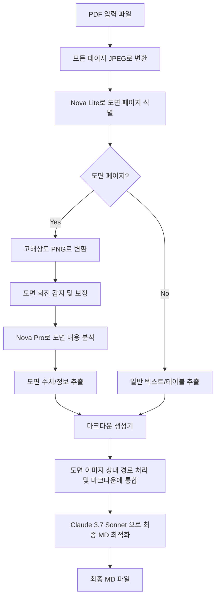
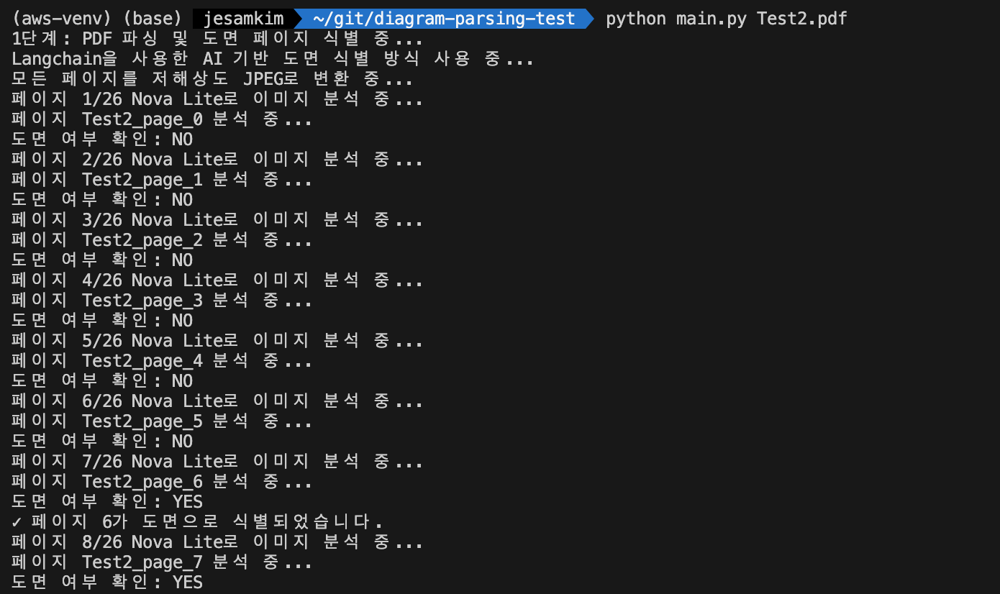
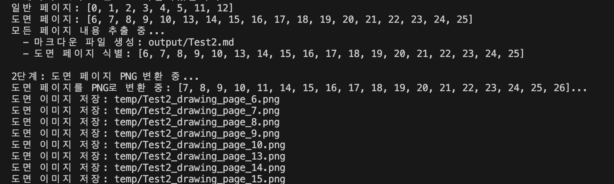
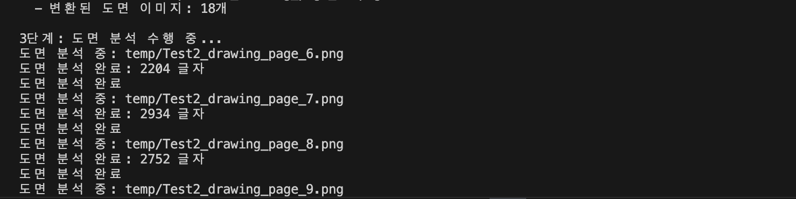
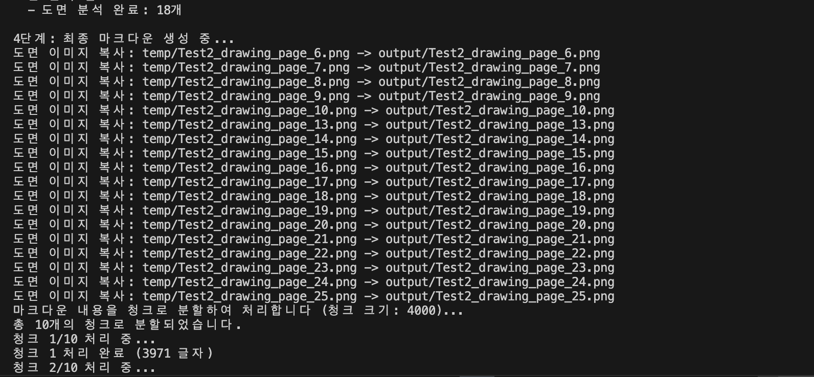
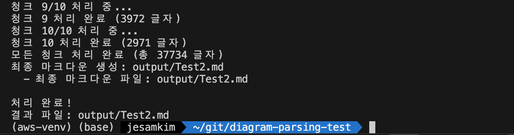

# PDF 도면 파싱 도구

PDF 파일에서 텍스트, 테이블, 이미지 및 도면을 추출하고 분석하여 마크다운 문서로 변환하는 도구입니다. 이 도구는 특히 도면이 포함된 PDF를 처리하는 데 최적화되어 있으며, Amazon Bedrock의 생성형 AI 모델의 멀티모달 기능을 활용하여 도면 내용을 자세히 분석합니다.

## 주요 기능

- PDF에서 일반 텍스트, 테이블, 이미지 추출 (pymupdf4llm 사용)
- Amazon Bedrock Nova Lite 모델을 사용한 도면 페이지 자동 식별
- 도면 페이지를 고품질 PNG로 변환 (pdf2image 사용)
- 회전된 도면 감지 및 보정
- Amazon Bedrock Nova Pro 모델을 사용한 도면 분석 :
  - 도면 유형 식별 (건축, 기계, 전기 등)
  - 수치 및 치수 추출
  - 테이블 형식 데이터 구조화
- Claude 3.7 Sonnet을 사용한 마크다운 문서 최적화
- 원본 PDF와 동일한 이름의 최종 마크다운 파일 생성

## Amazon Bedrock Nova Lite

이 프로젝트에서는 Amazon Bedrock의 Nova Lite 모델을 사용하여 PDF 파일에서 도면 페이지를 자동으로 식별합니다. Nova Lite는 매우 비용 효율적이면서도 빠른 속도로 이미지, 비디오, 텍스트 입력을 처리할 수 있는 멀티모달 모델입니다.

### Nova Lite를 사용한 도면 식별 프로세스

1. PDF의 모든 페이지를 저해상도 JPEG 이미지로 변환
2. 각 이미지를 Nova Lite 모델에 입력하여 분석
3. 모델이 직선, 도형, 치수, 기술적 표기가 많고 텍스트가 적은 페이지를 도면으로 식별
4. 도면으로 식별된 페이지만 고해상도 PNG로 변환하여 심층 분석 수행

Nova Lite 모델은 매우 빠른 추론 속도와 낮은 비용으로 대량의 PDF 페이지를 효율적으로 처리할 수 있어 도면 페이지 식별에 이상적입니다.

## 워크플로우

1. PDF 파싱 및 도면 페이지 식별 (Nova Lite 사용)
2. 도면 페이지 PNG 변환
3. 도면 이미지 분석 (Nova Pro 사용)
4. 마크다운 문서 생성 및 최적화 (Claude 3.7 Sonnet 사용)

## Amazon Bedrock 모델 비교

이 프로젝트는 다음과 같은 Amazon Bedrock의 AI 모델들을 활용합니다:

| 특성 | Nova Lite | Nova Pro | Claude 3.7 Sonnet |
|---|---|---|---|
| **주요 기능** | 고속 멀티모달 이해 | 고성능 멀티모달 분석 | 고급 텍스트 추론 및 생성 |
| **프로젝트 내 역할** | 도면 페이지 자동 식별 | 도면 내용 상세 분석 | 최종 마크다운 최적화 |
| **입력 모달리티** | 텍스트, 이미지, 비디오 | 텍스트, 이미지, 비디오 | 텍스트, 이미지 |
| **출력 모달리티** | 텍스트 | 텍스트 | 텍스트 |
| **최대 출력 토큰** | 5K | 5K | 8K |
| **특징** | 매우 빠른 처리 속도, 저비용 | 높은 정확도, 심층 분석 능력 | 확장된 사고(extended thinking) 능력, 내용 구조화 |
| **유스케이스** | 대량 이미지 분류, 빠른 시각 정보 처리 | 복잡한 도면 분석, 세부 정보 추출 | 마크다운 최적화, 텍스트 구조화 |
| **상대적 비용** | $ | $$ | $$ |
| **상대적 정확도** | ★★☆ | ★★★ | ★★★ |
| **상대적 속도** | ★★★ | ★★☆ | ★★☆ |

이 모델들의 조합을 통해 PDF 도면 파싱의 각 단계를 최적화하여 높은 성능과 비용 효율성을 달성합니다.

## 시스템 구성도



## 프로젝트 구조

```
├── main.py               # 메인 워크플로우 및 CLI 인터페이스
├── pdf_parser.py         # PDF 파싱 및 도면 페이지 식별
├── drawing_extractor.py  # 도면 페이지 PNG 변환
├── drawing_analyzer.py   # 도면 분석 (Nova Pro 사용)
├── md_generator.py       # 마크다운 생성 (Claude 3.7 Sonnet 사용)
├── aws_client.py         # AWS Bedrock 클라이언트
├── utils.py              # 유틸리티 함수
├── config.py             # 환경 설정
├── requirements.txt      # 필요 라이브러리
└── README.md             # 프로젝트 설명서
```

## 필요 조건

- Python 3.8 이상
- AWS 계정 및 자격 증명 (Amazon Bedrock 접근 권한 필요)
- 다음 라이브러리 및 의존성:
  - pymupdf4llm
  - pdf2image (poppler 의존성 필요)
  - boto3
  - langchain>=0.1.0
  - langchain-aws>=0.1.0
  - numpy
  - Pillow
  - PyMuPDF

## 설치 방법

### 1. 저장소 클론

```bash
git clone <저장소_URL>
cd <저장소_디렉토리>
```

### 2. 가상환경 생성 및 활성화 (권장)

```bash
python -m venv venv
source venv/bin/activate  # Linux/Mac
venv\Scripts\activate     # Windows
```

### 3. 의존성 설치

```bash
pip install -r requirements.txt
```

### 4. Poppler 설치 (pdf2image 의존성)

- **macOS**: `brew install poppler`
- **Ubuntu/Debian**: `sudo apt-get install poppler-utils`
- **Windows**: [Poppler for Windows](https://github.com/oschwartz10612/poppler-windows/releases/) 다운로드하고 PATH에 추가

### 5. AWS 자격 증명 설정

```bash
aws configure
```

AWS 설정 시 입력 정보:
- AWS Access Key ID 입력
- AWS Secret Access Key 입력
- Default region: `us-west-2`
- Default output format: `json`

## 사용 방법

### 기본 사용법

```bash
python main.py <PDF_파일_경로>
```

### 추가 옵션

```bash
# 실행 전 임시 디렉토리 정리
python main.py <PDF_파일_경로> --clean

# 도면 분석 단계 건너뛰기 (개발/테스트 시 유용)
python main.py <PDF_파일_경로> --skip-analysis

# Claude 최적화 단계 건너뛰기 (개발/테스트 시 유용)
python main.py <PDF_파일_경로> --skip-claude
```

### 예시

```bash
python main.py sample_building_blueprint.pdf
```

## 처리 단계별 출력 결과

PDF 도면 파싱 도구의 주요 처리 단계별 출력 결과는 다음과 같습니다:

### Step 1: PDF 파싱 및 도면 페이지 식별 (Nova Lite)

첫 번째 단계에서는 Nova Lite 모델을 사용하여 PDF의 모든 페이지를 분석하고 도면 페이지를 식별합니다.



### Step 2: 도면 페이지 PNG 변환

식별된 도면 페이지만 고품질 PNG로 변환하고 필요한 경우 회전을 보정합니다.



### Step 3: 도면 이미지 분석 (Nova Pro)

Nova Pro 모델은 변환된 도면 이미지를 분석하여 상세 정보를 추출합니다.



### Step 4: 마크다운 생성 및 최적화 (Claude 3.7 Sonnet)

마지막으로 Claude 3.7 Sonnet 모델을 사용하여 최종 마크다운 문서를 생성하고 최적화합니다.

 <br>


## 결과물

- `temp/` 디렉토리: 추출된 이미지 및 변환된 도면 파일
- `output/` 디렉토리: 최종 마크다운 결과 파일
- `<PDF_이름>.md`: 원본 PDF와 동일한 이름의 마크다운 결과 파일
- `<PDF_이름>_drawing_analysis.json`: 도면 분석 결과 (디버깅용)

## 주의사항

- **AWS API 호출 비용**: Amazon Bedrock API 사용에는 비용이 발생할 수 있습니다.
- **도면 이미지 경로**: 최종 마크다운 파일에서 도면 이미지는 상대 경로로 참조되며, output/ 디렉토리에 복사됩니다.
- **처리 시간**: 도면 크기, 복잡도, 페이지 수에 따라 처리 시간이 달라집니다.
- **도면 식별**: AI 기반 도면 식별은 일부 도면을 인식하지 못할 수 있습니다.

## 문제 해결

### 일반적인 문제

1. **ImportError 발생 시**
   - requirements.txt 재설치
   - Python 버전 확인 (3.8 이상 필요)

2. **AWS 인증 관련 에러**
   - AWS CLI 자격 증명 재설정
   - IAM 권한 확인 (Amazon Bedrock 서비스 접근 권한 필요)

3. **pdf2image 관련 오류**
   - Poppler가 올바르게 설치되었는지 확인
   - PATH 환경 변수 설정 확인

4. **도면 인식 실패**
   - AWS Bedrock Nova Lite 및 Nova Pro 모델에 접근 권한 확인


## References

- [Amazon Bedrock 문서](https://docs.aws.amazon.com/bedrock/)
- [PDF2Image 문서](https://github.com/Belval/pdf2image)
- [PyMuPDF 문서](https://pymupdf.readthedocs.io/)
